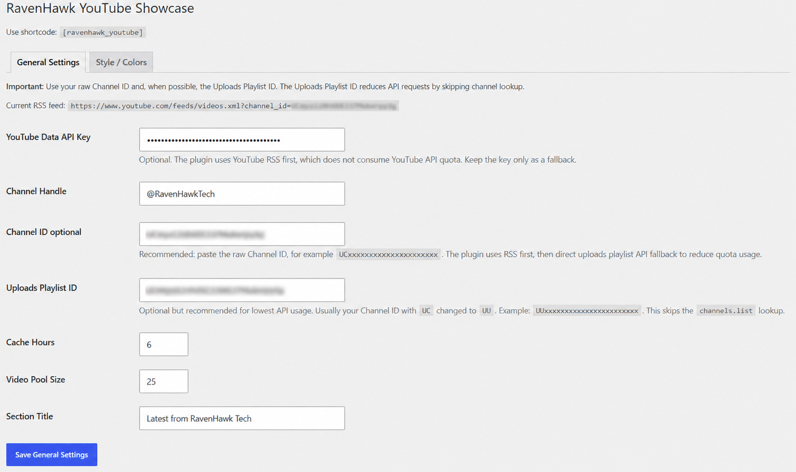
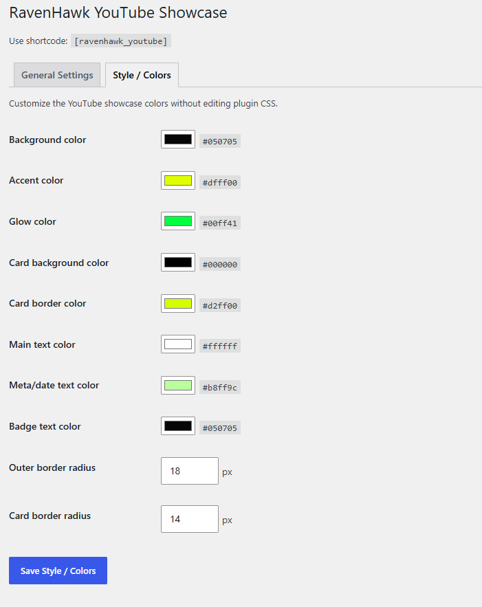
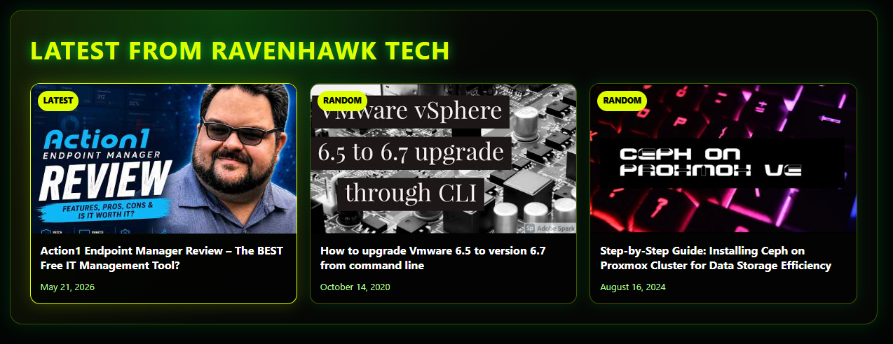

# RavenHawk YouTube Showcase

Styled WordPress YouTube showcase plugin with shortcode support, RSS-first loading, API fallback, cache controls, and tabbed admin color settings.

This repository contains the RavenHawk YouTube Showcase plugin package, update manifest, screenshots, and repository documentation for RavenHawkTech.

## Current Version

**v2.1.0**

## Features

- Displays the latest YouTube video plus random videos from the configured channel
- Shortcode support with `[ravenhawk_youtube]`
- YouTube RSS-first loading to reduce API quota usage
- Optional YouTube Data API fallback
- Cache controls and configurable video pool size
- RavenHawkTech admin menu grouping
- Tabbed admin page with General Settings and Style / Colors
- Editable colors and border-radius controls
- GitHub manifest-based update metadata

## Screenshots

### General Settings



### Style / Colors



### Frontend Preview



## Shortcode

```text
[ravenhawk_youtube]
```

Optional title override:

```text
[ravenhawk_youtube title="Latest from RavenHawkTech"]
```

## Admin Settings

Open:

```text
RavenHawkTech → YouTube Showcase
```

Tabs:

```text
General Settings
Style / Colors
```

## Repository Structure

This repository tracks the plugin package instead of the extracted plugin source files.

```text
/
├─ README.md
├─ SECURITY.md
├─ COPYRIGHT.md
├─ gitignore.txt
├─ releases/
│  └─ ravenhawk-youtube-showcase.zip
├─ screenshots/
│  ├─ README.md
│  ├─ youtube-showcase-general-settings.png
│  ├─ youtube-showcase-style-colors.png
│  └─ youtube-showcase-frontpage-preview.png
└─ updates/
   └─ ravenhawk-youtube-showcase.json
```

The package contains the full WordPress plugin folder, including the plugin PHP file, admin icon assets, and plugin README.

## Installation

1. In WordPress Admin, go to **Plugins → Add Plugin**.
2. Click **Upload Plugin**.
3. Choose the RavenHawk YouTube Showcase package.
4. Click **Install Now**.
5. Activate the plugin.
6. Open **RavenHawkTech → YouTube Showcase** in WordPress Admin.

## Support RavenHawkTech

[](https://www.buymeacoffee.com/wbakke7496c)

## RavenHawkTech

Website: https://ravenhawktech.com

## License

GPL-3.0 unless otherwise noted.
